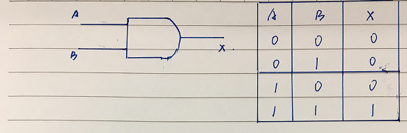
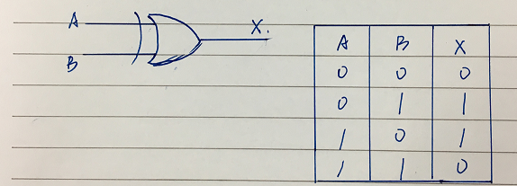
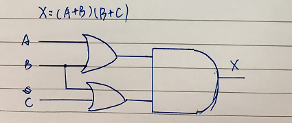
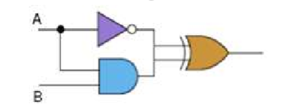
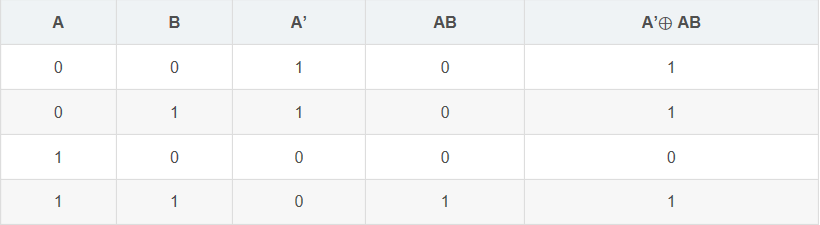
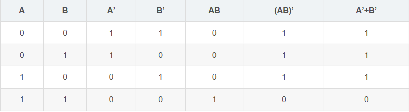
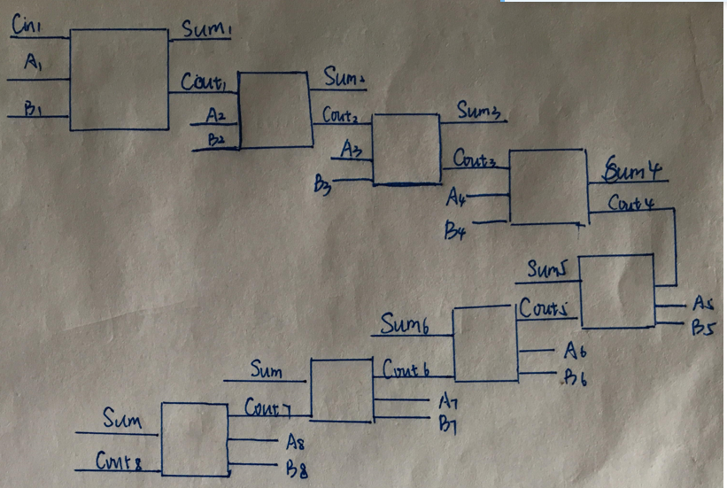

# 使用维基百科（Wikipedia）解释名词
##  Logic gate 逻辑门
> In electronics, a logic gate is an idealized or physical device implementing a Boolean function; that is, it performs a logical operation on one or more binary inputs and produces a single binary output.  在电子学中，逻辑门是实现布尔函数的理想化或物理设备；即，它对一个或多个二进制输入执行逻辑操作并产生单个二进制输出。 
##  Boolean algebra 布尔代数
> 在抽象代数中，布尔代数（英语：Boolean algebra）是捕获了集合运算和逻辑运算二者的根本性质的一个代数结构（就是说一组元素和服从定义的公理的在这些元素上运算）。
# Flip-flop
## 触发器（英语：Flip-flop, FF），中国大陆译作“触发器”、台湾及香港译作“正反器”，是一种具有两种稳态的用于储存的元件，可记录二进制数字信号“1”和“0”。
## 可以存储1 bits
# 与门
## 1.与门的数学逻辑表达式：Y = AB。 
## 2.Logic Diagram Symbol:如下图
## 3.Truth Table:如下图

## and：是指AB同时为1时结果为1，否则为0。
# 异或门
## 1.逻辑表达式：X = A ⊕ B（⊕为“异或”运算符）
## 2.Logic Diagram Symbol:如下图
## 3.Truth Table:如下图

## xor：指异或的意思，如果a、b两个值不相同，则异或结果为1。如果a、b两个值相同，异或结果为0。
# (A + B)(B + C) 

# Show the behavior of the following circuit with a truth table:

# (AB)’ = A’ + B’

## There are eight 1bit full adder integrated circuits. Combine them to 8bit adder circuit using the following box diagram.

-------------------------------------------------------------------------------
1. (0000 X2+1 X3+1 X2+1 X1+1)2
2. (X8 ⊕ 0 X7 ⊕ 0 X6 ⊕ 0 X5 ⊕ 0 X4 ⊕ 1 X3 ⊕ 1 X2 ⊕ 1 X1 ⊕ 1)2
3. ( X8 X7 X6 X5 X4 X3 X2 X1 )2
