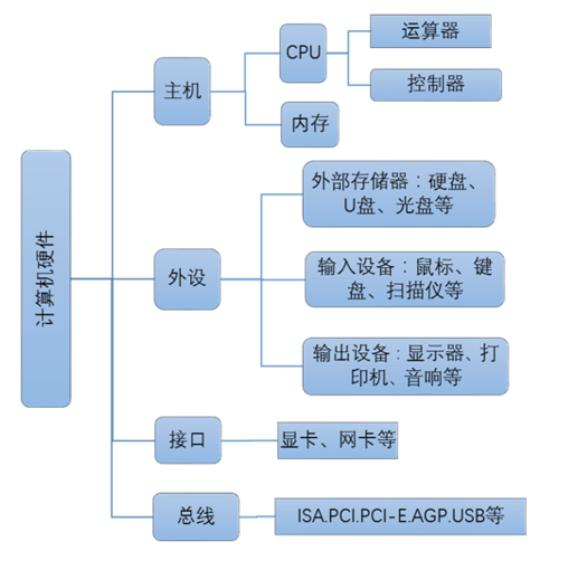

# 使用维基百科（Wikipedia）解释名词
##  CPU 中央处理器
> 中央处理器 （英语：Central Processing Unit，缩写：CPU），是计算机的主要设备之一，功能主要是解释计算机指令以及处理计算机软件中的数据。
##  RAM 随机存取存储器
> 随机存取存储器（英语：Random Access Memory，缩写：RAM），也叫主存，是与CPU直接交换数据的内部存储器。它可以随时读写（刷新时除外，见下文），而且速度很快，通常作为操作系统或其他正在运行中的程序的临时数据存储介质。
##  ROM 只读存储器
> 只读存储器（Read-Only Memory，ROM）是一种半导体存储器，其特性是一旦存储数据就无法再将之改变或删除，且内容不会因为电源关闭而消失。
##  Bus (computing) 总线
> 总线（Bus）是指计算机组件间规范化的交换数据（data）的方式，即以一种通用的方式为各组件提供数据传送和控制逻辑。
##  Parallel Computing  并行计算
> 并行计算（英语：parallel computing）一般是指许多指令得以同时进行的计算模式。在同时进行的前提下，可以将计算的过程分解成小部分，之后以并发方式来加以解决。
# 问题回答
1、According to the von Neumann architecture, List basic parts of a computer. 

2、A computer has 64 MB (megabytes) of memory. How many bits are needed to address any single byte in memory?

需要26位

3、List basic parts of a CPU, include cache or not?

中央处理器主要包括运算器（算术逻辑运算单元，ALU，Arithmetic Logic Unit）和高速缓冲存储器（Cache）及实现它们之间联系的数据（Data）、控制及状态的总线（Bus），包括Cache。

4、What mean secondary storage. List some on your PC. 

二级存储（secondary storage，auxiliary storage）是计算机主存储器或内存之外的所有可访问数据存储器。硬盘，光盘。

5、写一段文字，简单解释“云计算（cloud computing）

云计算是一种按使用量付费的模式，这种模式提供可用的、便捷的、按需的网络访问， 进入可配置的计算资源共享池（资源包括网络，服务器，存储，应用软件，服务），这些资源能够被快速提供，只需投入很少的管理工作，或与服务供应商进行很少的交互。

1）DDR3内存，“3”和“1333”的含义是什么？ 

DDR3是指DDR3代。 1333是内存分频率

2）小孙买8G DDR3-1600的内存能提高性能吗？ 

不能，因为内存分频率不同。

3）小孙买4G*2 DDR3-1333的内存能提高性能吗？ 

可以，因为双通道会提升总线带宽，但效果不明显。

4）16G需要多少位地址？

34位。