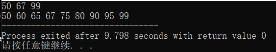

# 问题回答
## 1. Bubble Sort the list: 33, 56, 17, 8, 95, 22。Make sure the final result is from small to large. Write out the list after the 2nd pass. (10 points) 

* 33 56 17 8 95 22

## 2. Give a sorted array as list={60,65,75,80,90,95}. Design an algorithm to insert the value of x into the sorted array. Then test the algorithm with value 50,67,99. 思考：为什么选择插入点在list头上、中间、尾巴上的三个数作为算 法测试的数据，你能解释吗？

```c
#include <stdio.h> 
void sort(int arr[]) {
	int temp = 0;
	for (int i = 0; i < 9; ++i) {
		for (int j = 0; j < 8 - i; ++j) {
			if (arr[j] > arr[j + 1]) {
				temp = arr[j];
				arr[j] = arr[j + 1];
				arr[j + 1] = temp;
			}
		}
	}
	for (int i = 0; i < 9; ++i)
		printf("%d ",arr[i]);
}
int main() {
	int arr[9] = {60,65,75,80,90,95};
	int num1,num2,num3;
	scanf("%d %d %d",&num1,&num2,&num3);
	arr[6] = num1;
	arr[7] = num2;
	arr[8] = num3;
	sort(arr);
}
```
执行结果如下


* 充分测试程序，减少出BUG的可能性。


## 3. What is the state of the stack after the following sequence of Push and Pop operations? Push “anne”; Push “get”; Push “your” ; Pop; Push “my” Push “gun” 

* gun 
* my
* get
* anne
