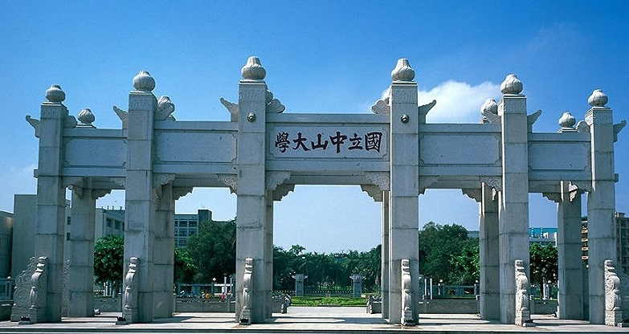
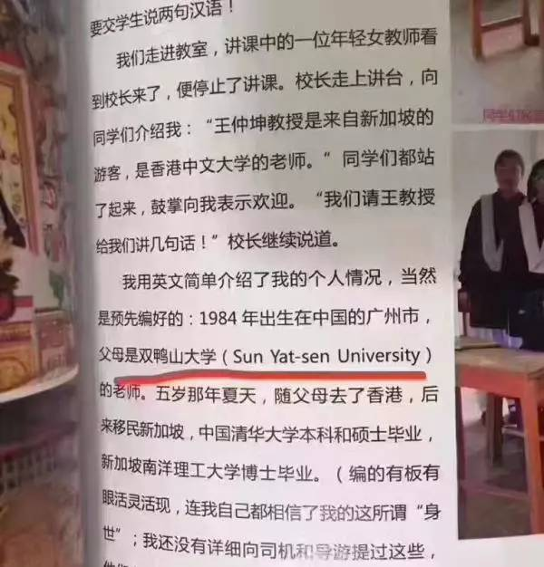
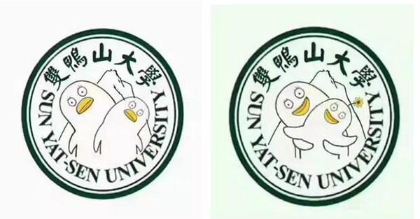

# &nbsp;&nbsp;“双鸭山大学”的来源

### &nbsp;&nbsp;“双鸭山大学“的劲爆原图

##### （此图来自自称是截图书作者的“云湖浪子YZ25T”在微信公号上的声明）  
### &nbsp;&nbsp;原来就是这位仁兄让我们“双鸭山”大学风靡全网啊！
&nbsp;&nbsp;“云湖浪子YZ25T”还表示“双鸭山大学”并非错译，而是在自己小圈子里已流传长达五年的一个梗。五年前他在广州坐地铁，即2012年12月27日，路过“中山大学”站，才知道中山大学的英文名就是“Sun Yat-sen University”，但听音像“双鸭山大学”，于是他当时就在校内网上发照片说：“原来中山大学的英文是……双鸭山大学……”
看来，“梗”本自天成啊，想不到中山大学的英文谐音竟产生了这样的梗，成为每一个中大人的趣闻。

&nbsp;&nbsp; [以上部分图文转载自搜狐网](http://www.sohu.com/a/152103186_384562)
# &nbsp;&nbsp;“双鸭山大学”的正确打开方式
&nbsp;&nbsp;中山大学（Sun Yat-sen University, SYSU），简称“中大”，由孙中山先生创办，有着一百多年办学传统，是中国南方科学研究、文化学术与人才培养的重镇。   

&nbsp;&nbsp;中山大学是教育部、国家国防科技工业局和广东省共建的全国重点大学，是国家“双一流”A类、“985工程”、“211工程”重点建设高校，同时也是“珠峰计划”、“111计划”、“卓越法律人才教育培养计划”、“卓越医生教育培养计划”实施高校。中山大学已经成为一所国内一流、国际知名的现代综合性大学，正努力成为全球学术重镇   。     
&nbsp;&nbsp;学校有18个学科领域进入ESI世界前1%，学科领域数量位居国内高校第2位，其中有14个学科领域进入前0.5%，2个学科领域进入前0.1%。在第三轮全国学科评估中，33个参评学科有16个学科进入水平排名前5，32个学科进入水平排名前10。   
&nbsp;&nbsp;现有院士20人，国家“千人计划”专家119人、享受政府特殊津贴专家138人、“长江学者”特聘教授46人、“长江学者”青年学者14人、国家杰出青年科学基金获得者81人，“百千万人才工程” 国家级人选28人，教育部新世纪优秀人才支持计划170人，历次主持“973”项目和重大科学研究项目的首席科学家20人次。   
&nbsp;&nbsp;拥有10个国家级人才培养基地，经济管理等多个本科专业通过了国内、国际认证。入选教育部的基础学科拔尖学生培养试验计划、卓越医生教育培养计划、卓越法律人才培养教育计划，与法国民用核能工程师教学联盟等国际一流大学开展的中外合作办学项目顺利通过相关国际认证。并拥有10家附属医院。
 ###### （以上转自百度百科）
想了解更多关于“双鸭山大学”的信息？[中大官网](http://www.sysu.edu.cn/2012/cn/index.htm)   [中大贴吧](http://tieba.baidu.com/f?fr=wwwt&kw=%E4%B8%AD%E5%B1%B1%E5%A4%A7%E5%AD%A6)
