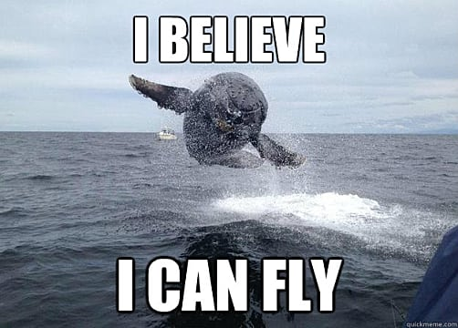
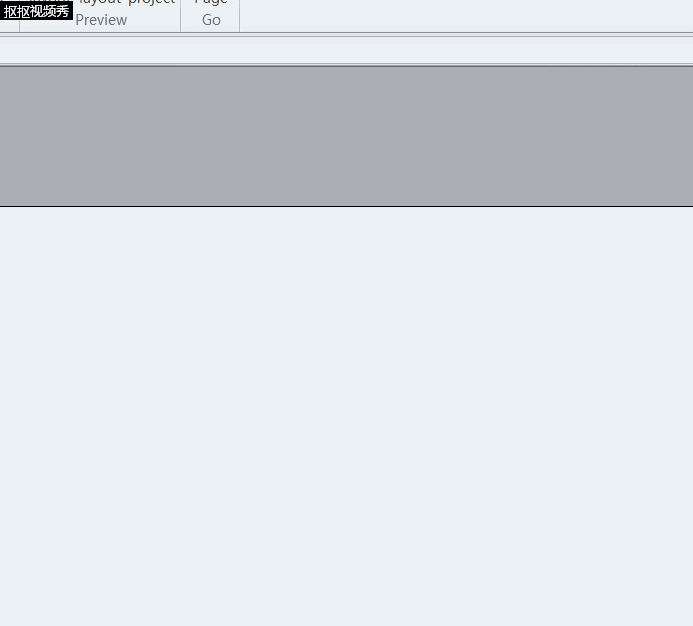
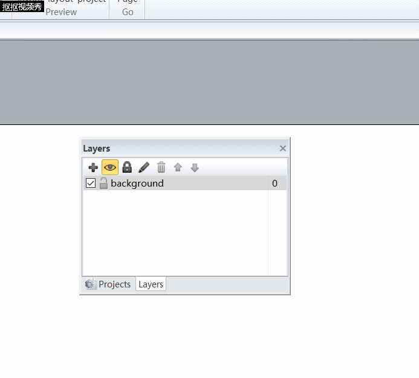
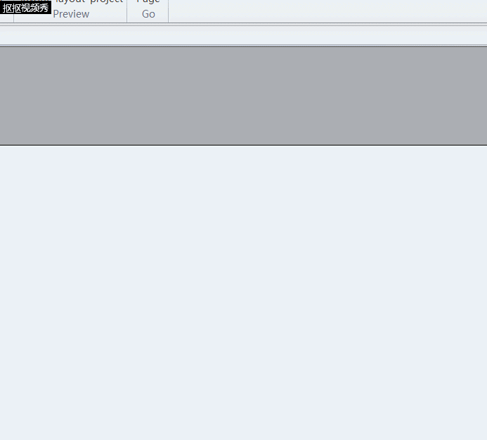
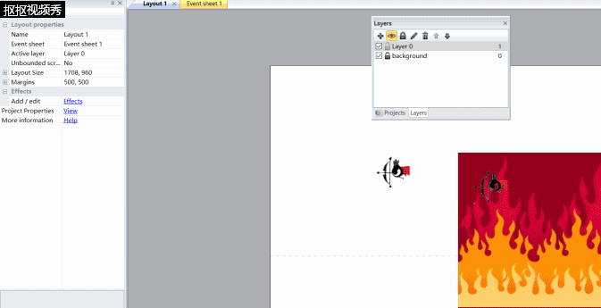
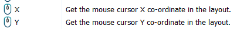
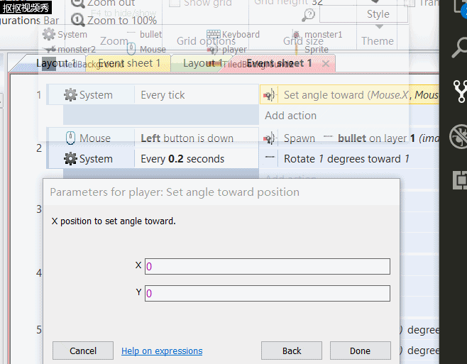
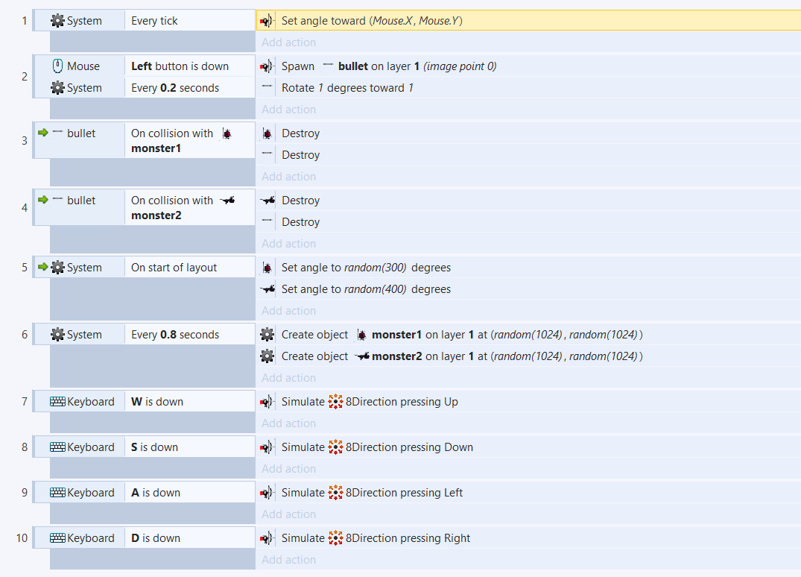
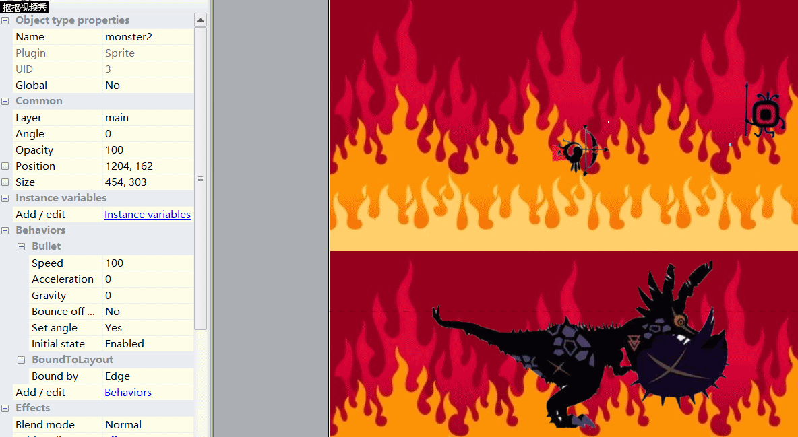

# 使用construct2制作属于自己的小游戏

- 思考自己想做什么游戏？怎么做？(应包含且不仅包含以下方面)
  - 游戏本体
    - 游戏背景（内容）
    - 操作方式（玩法）
    - 游戏目的（核心）
  - 制作工具（资源）
    - construct2
    - 网络资源
- 安装construct2
  - [安装地址](https://www.scirra.com/construct2)
  - 解压安装
  - [参考入门指南](https://www.scirra.com/tutorials/top)
  
  
## 如果你已经有想法了，就开始动手吧！

- 前期准备
    - 在construct2新建一个New empty project
    - 双击空白处新建一个background并在空白处放置（放置前会有十字指标）
    
    - 选择好游戏背景图并锁定,新建一个新的图层并选择第二图层
    
    若没有看见此窗口，可从左上view勾选layer bar
- 第二步——添加object
    - 添加player 
    - 添加enemy（Ctrl+S能复制）
    - 添加bullet（要放在画布之外）
    - 添加你喜欢的东西
    
    PS：可以使用win10自带的画图3D进行抠图
- 第三步——赋予object以behavior
    
     - 8 Direction movement: 这个行为可以让你实现给角色添加方向移动（方向键）的功能。 
     - Bullet movement:这个行为让对象朝着它当前的角度移动，比如，本例中玩家射出的子弹的移动行为，不要被这名字迷惑了，它不只适用于子弹，也可以应用于怪物等移动。在Contruct2里所有的移动行为都是通过添加速度向前行进。 
     - Scroll to：这个行为可以让运行时画布随着对象移来移去（滚动）。这个行为很适合于角色。 
     - Bound to layout：这个行为可以防止对象离开画布区域。这个行为对于角色来说也很重要。 
     - Destroy outside layout:当对象离开画布区域时，就将其销毁。比如本例中的子弹，如果不销毁的话，虽然子弹离开画布区域了，但是依然暂用内存。所以我们需要及时销毁不再需要的对象。 
     - Fade:这个行为可以给对象添加淡出效果，用于爆炸等特效的消失。
     - 给Bullet对象添加Bullet movement和Destroy outside layout行为。 
     - 给Monster对象添加Bullet movement行为。 
     - 给Explosion对象添加Fade行为。Fade行为默认会销毁对象，所以不用担心对象有没有销毁。
[感谢老学长的指导](https://blog.csdn.net/ZhangyunqingGC/article/details/78360290)  
---------------------
- 第四步——开始调试操作、游戏设置
## &nbsp;&nbsp;&nbsp;&nbsp;&nbsp;&nbsp;&nbsp;举个例子
  - 前提操作（以插入object的方式插入键鼠）
  - 切换到Event sheet1页面点击Add event→system→every tick
  - 然后Add actio→选择player→Set angle toward position→Mouse→
  - PS：上面半透明的可以充当设置指南

### &nbsp;&nbsp;&nbsp;&nbsp;&nbsp;&nbsp;&nbsp;&nbsp;&nbsp;&nbsp;&nbsp;&nbsp;&nbsp;&nbsp;后面就是按照你的想法自由发挥啦

>  以上仅供参考
- 第五步——运行游戏，修改设定
    - 发现怪飞得老快？嫌弃角色飞的太慢？来修改参数吧
    
- 第六步——优化游戏
    - 怪物乱飞：System→On start of Layout Monster→Set angle→random(360)  
    - 怪物碰到边缘返回：Monster→Is outside layout  Monster→Set angle toward position→For X，Player.X - for Y,Player.Y 
    - 还有各种例如设置血量，时间，计分等，有需要可以百度寻找方法

---------------------
# 个人游戏设计过程
## 游戏策划
* 楔子(Setting)：从上次勇者拯救世界已过千年之久，被封印在地狱里的魔物又开始蠢蠢欲动，这一次勇者决定主动出击，打开地狱的传送门，再次封印那些邪恶的怪物，不料魔物的数量远超想象，勇者也难以匹敌，传送门的另一端援军已在赶来，坚持住！保卫传送门！
## 玩法(Gameplay)：
* 保护传送门！抵抗红眼怪物的入侵！坚持到最后！ 
## 楔子(Setting)：
* 从上次勇者拯救世界已过千年之久，被封印在地狱里的魔物又开始蠢蠢欲动，这一次勇者决定主动出击，打开地狱的传送门，再次封印那些邪恶的怪物，不料魔物的数量远超想象，勇者也难以匹敌，传送门的另一端援军已在赶来，坚持住！保卫传送门！ 
## 人设与道具（Game Sprites）： 
* Player：手拿神弓的超级大眼萌，为守卫地狱传送门死守于此 
* 怪物: 邪恶的红眼暴龙 & 邪恶的红眼小兵 
## 游戏设计
```
| Object Name    | player                                  |
| Attributes     | (372, 240)                              |
| Collaborator   | Sprite                                  |
|Events & Actions| 8Direction & ScrollTo & BoundToLayout   |
```
```
| Object Name    | monster1                                |
| Attributes     | (random)                                |
| Collaborator   | Sprite                                  |
|Events & Actions| BoundToLayout & Bullet                  |
```
```
| Object Name    | monster2                                |
| Attributes     | (random)                                |
| Collaborator   | Sprite                                  |
|Events & Actions| BoundToLayout & Bullet                  |
```
```
| Object Name    | Bullet                                  |
| Attributes     | (舞台外)                                 |
| Collaborator   | Sprite                                  |
|Events & Actions| DestroyOutsideLayout & 碰撞并销毁自己    |
```
```
| Object Name    | 传送门                                   |
| Attributes     | (1624, 433)                             |
| Collaborator   | Sprite                                  |
|Events & Actions| 碰撞并销毁自己                           |
```
## 个CAI人JI作品展示
