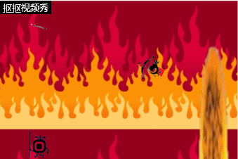

---
layout: default
title: 制作 HTML5 游戏
p{ white-space:pre-wrap;}

---------------------
# 使用construct2制作属于自己的小游戏

- 思考自己想做什么游戏？怎么做？(应包含且不仅包含以下方面)
  - 游戏本体
    - 游戏背景（内容）
    - 操作方式（玩法）
    - 游戏目的（核心）
  - 制作工具（资源）
    - construct2
    - 网络资源
- 安装construct2
  - [安装地址](https://www.scirra.com/construct2)
  - 解压安装
  - [参考入门指南](https://www.scirra.com/tutorials/top)
* 如果你准备好了，就开始动手吧！

- 1.在construct2新建一个New empty project
- 2.新设背景
    - level 3 item
    - level 3 item
    - level 1 item
  - level 2 item
  - level 2 item
    - level 3 item
    - level 3 item
    - level 1 item
  - level 2 item
  - level 2 item
    - level 3 item
    - level 3 item
    - level 1 item
  - level 2 item
  - level 2 item
    - level 3 item
    - level 3 item
    - level 1 item
  - level 2 item
  - level 2 item
    - level 3 item
    - level 3 item
    - level 1 item
  - level 2 item
  - level 2 item
    - level 3 item
    - level 3 item
