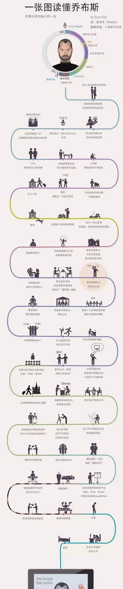
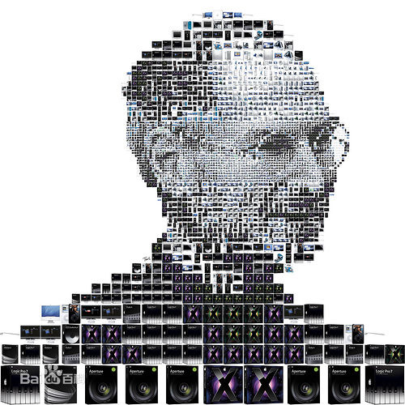
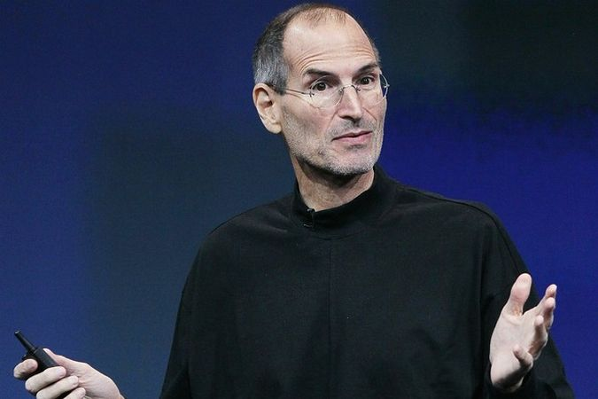

# Steve Jobs——改变世界的IT人
## 乔布斯生平与评价
* 史蒂夫·乔布斯（Steve Jobs，1955年2月24日—2011年10月5日），出生于美国加利福尼亚州旧金山，美国发明家、企业家、美国苹果公司联合创办人。
* 他被认为是计算机业界与娱乐业界的标志性人物，他经历了苹果公司几十年的起落与兴衰，先后领导和推出了麦金塔计算机（Macintosh）、iMac、iPod、iPhone、iPad等风靡全球的电子产品，深刻地改变了现代通讯、娱乐、生活方式。
* 2011年10月5日，史蒂夫·乔布斯因患胰腺癌病逝，享年56岁。

## “苹果教父”乔布斯辍学了？
* 关于乔布斯从里德学院辍学的原因，以前的有的版本是因为乔布斯自己认为已经学到了关于计算机的核心知识，而事实上是生活所迫————父母只是一般蓝领，里德学院高昂的学费实在让这个家庭承担不起。
* 但乔布斯并为就此离开大学，而是在那里旁听书法课程，逗留了一年多才彻底离开，他后来在一次演讲中说：“我把学到的书法只是全都融入到了苹果电脑的设计当中，如果那时我没有旁听这门课程，那恐怕现在的电脑也不会有那么多字体。”也正是那时他对书法这门课程的学习才使科学与人文完美的结合，从而使苹果日益壮大。

## 离去与回归
* 1983年，Lisa数据库和Apple Iie发布，售价分别为9998美元和1395美元。但是Lisa的昂贵的售价是没有多少市场的，而Lisa又侵吞了Apple大量研发经费。
* 由于乔布斯经营理念与当时大多数管理人员不同，加上IBM公司推出个人电脑，抢占大片市场，总经理和董事们便把这一失败归罪于董事长乔布斯，于1985年4月经由董事会决议撤销了他的经营大权。乔布斯几次想夺回权力均未成功，便在1985年9月17日离开苹果公司。
* 1996年苹果公司经营陷入困局，其市场份额也由鼎盛的16%跌到4%。与之相对应的是乔布斯公司由于《玩具总动员》而名声大振，个人身价达到10亿美元。但是乔布斯还是于苹果危难之中重新回来，回来后的乔布斯大刀阔斧改革，停止了不合理的研发和生产，结束了微软和苹果多年的专利纷争，并开始研发新产品iMac和OS X操作系统。
## 辉煌与谢幕
* 1997年苹果推出iMac，创新的外壳颜色透明设计使得产品大卖，并让苹果度过财政危机。随后苹果又推出Mac OS X操作系统。
* 2000年科技股泡沫，乔布斯又提出将PC设计成“数字中枢“先进理念，并先后开发出iTunes和iPod，同时也开始在黄金地段开设专卖店并大获成功。随后Apple TV和iTunes Store等一系列产品受到了市场的好评和认可。
* 2007年6月29日，苹果公司又推出自有设计的iPhone手机，使用iOS系统，随后发布新一代iPhone 3G以及iPhone 3GS。
* 2010年6月8日又发布第四代产品iPhone 4，每次上市都引得了世界极大的疯狂和销售热潮。
* 除了iPhone系列之外，发布使用iOS系统的iPad平板电脑，这一起先不被众人看好的产品，最后获得了巨大的成功。
* 2011年8月24日，史蒂夫·乔布斯向苹果董事会提交辞职申请。
* 2011年8月25日，苹果宣布他辞职，并立即生效，职位由蒂姆·库克接任。
* 北京时间2011年10月6日，苹果董事会宣布前行政总裁乔布斯于当地时间10月5日逝世，终年56岁，葬礼于10月7日举行。

编者：乔布斯说过“创新决定了你是领袖还是跟随者。”作为准IT人，我们更加要开阔我们的视野，充分发挥自己的想象力，不要被条条框框所局限。走在世界前列，让科技和美相遇，未来属于有创造力的人。