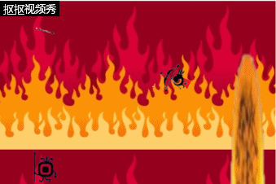

## 游戏策划
* 楔子(Setting)：从上次勇者拯救世界已过千年之久，被封印在地狱里的魔物又开始蠢蠢欲动，这一次勇者决定主动出击，打开地狱的传送门，再次封印那些邪恶的怪物，不料魔物的数量远超想象，勇者也难以匹敌，传送门的另一端援军已在赶来，坚持住！保卫传送门！
## 玩法(Gameplay)：
* 保护传送门！抵抗红眼怪物的入侵！坚持到最后！ 
## 楔子(Setting)：
* 从上次勇者拯救世界已过千年之久，被封印在地狱里的魔物又开始蠢蠢欲动，这一次勇者决定主动出击，打开地狱的传送门，再次封印那些邪恶的怪物，不料魔物的数量远超想象，勇者也难以匹敌，传送门的另一端援军已在赶来，坚持住！保卫传送门！ 
## 人设与道具（Game Sprites）： 
* Player：手拿神弓的超级大眼萌，为守卫地狱传送门死守于此 
* 怪物: 邪恶的红眼暴龙 & 邪恶的红眼小兵 
## 游戏设计

* Object Name    player
* Attributes  (372, 240)  
* Collaborator | Sprite |
* Events & Actions  | 8Direction & ScrollTo & BoundToLayout |
* Object Name    player
* Attributes  (372, 240)  
* Collaborator | Sprite |
* Events & Actions  | 8Direction & ScrollTo & BoundToLayout |
* Object Name    player
* Attributes  (372, 240)  
* Collaborator | Sprite |
* Events & Actions  | 8Direction & ScrollTo & BoundToLayout |
* Object Name    player
* Attributes  (372, 240)  
* Collaborator | Sprite |
* Events & Actions  | 8Direction & ScrollTo & BoundToLayout |
* Object Name    player
* Attributes  (372, 240)  
* Collaborator | Sprite |
* Events & Actions  | 8Direction & ScrollTo & BoundToLayout |
## 个CAI人JI作品展示
