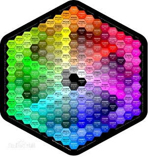

# 色彩表示与编码
## 大自然色彩缤纷，存在着万千种颜色，有一些甚至人的眼睛也难以区别开来，那么，计算机又怎样表示和存储的呢？

### (十六进制颜色码就是在软件中设定颜色值的代码)
## 原来计算机是通过十六进制来显示颜色的:
*  一种方式是以定义好的颜色名称表示，具体的颜色名称针对不同的浏览器也有所不同。另一种方式通过一个以“#”开头的6位十六进制数值表示一种颜色。6位数字分为3组，每组两位，依次表示红、绿、蓝三种颜色的强度

### 发光体的颜色模式，又称为“加色模式”，三原色是“红”、“绿”、“蓝”三种颜色。加色模式又称为“RGB”模式 ,而对于印刷品这样的颜色模式，又称为“减色模式”，它的三原色是“青”、“洋红”、“黄”三种颜色。减色模式又称为“CMYK”模式。

* RGB 函数说明
* 可以接受颜色说明的应用程序的方法和属性期望这个说明是一个代表 RGB 颜色值的数值。一个 RGB 颜色值指定红、绿、蓝三原色的相对亮度，生成一个用于显示的特定颜色。

* 用法 RGB() 函数使用下述公式计算表示颜色的长整数：Red+ 256 * Green+65536 *Blue其中，Blue代表蓝色分量，Green代表绿色分量，Red代表红色分量。各分量中，数值越小，亮度越低，数值越大，亮度越高。

* CMYK 说明
* CMYK也称作印刷色彩模式，顾名思义就是用来印刷的。它和RGB相比有一个很大的不同：RGB模式是一种发光的色彩模式，你在一间黑暗的房间内仍然可以看见屏幕上的内容。

* 只要在屏幕上显示的图像，就是RGB模式表现的。只要是在印刷品上看到的图像，就是CMYK模式表现的。比如期刊、杂志、报纸、宣传画等，都是印刷出来的，那么就是CMYK模式的了。

