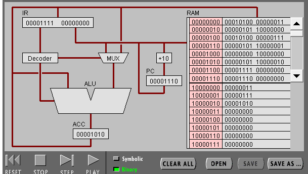
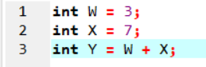
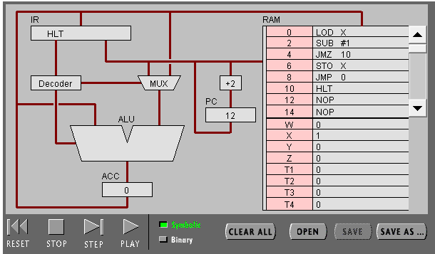
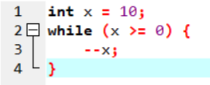
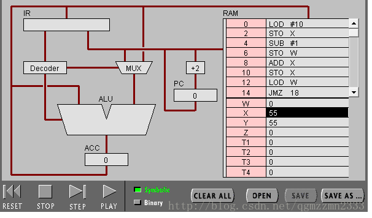
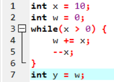

# 机器语言实验报告
## 任务 1：简单程序
（1）打开网页 The PIPPIN User’s Guide ，然后输入 Program 1：Add 2 number

（2）点step after step。

观察并回答下面问题：

PC，IR 寄存器的作用。

> PC：存放正待取出的指令的地址。根据pc中的指令地址，准备从内存中取出将要执行的指令。程序按照顺序逐条执行，自动加1。

> AR：存放正要取出的指令的地址或操作数的地址，根据此地址从存储器中取出指令。将pc中存放的指令地址送至AR，根据此地址从内存中取出指令。

ACC 寄存器的全称与作用。

> CC（Accumulator）是累加器A缩写。累加器A是一个具有特殊用途的二进制8位寄存器，专门用来存放操作数或运算结果。在CPU执行某种运算前，两个操作数中的一个通常应放在累加器A中，运算完成后累加器A中便可得到运算结果

用“LOD #3”指令的执行过程，解释Fetch-Execute周期。

* PC 根据地址从RAM取出指令LOD #3 
* 指令传入IR，指令传入Decoder，无需取址，数字3传入MUX 
* 数字3传入ALU之后传入ACC

用“ADD W” 指令的执行过程，解释Fetch-Execute周期。

* PC根据地址从RAM取出指令ADD W 
* 指令传入IR之后传入Decoder 
* ALU从ACC中取值 
* IR再次访问RAM中的W，从W中取值 
* W的值读入ALU 
* ALU执行加法，结果传入ACC

“LOD #3” 与 “ADD W” 指令的执行在Fetch-Execute周期级别，有什么不同。

* LOD #3只需访问RAM一次,而ADD W需要两次访问RAM

（3）点击“Binary”,观察回答下面问题

写出指令 “LOD #7” 的二进制形式，按指令结构，解释每部分的含义。

* 00010100 00000111 一个为步骤,另一个为操作数

解释 RAM 的地址。

* 只用于暂时存放程序和数据，一旦关闭电源或发生断电，其中的程序和数据就会丢失

该机器CPU是几位的？（按累加器的位数）

* 32位

写出该程序对应的 C语言表达。

## 任务 2：简单循环

（1） 输入程序Program 2，运行并回答问题：

用一句话总结程序的功能

* 使 x 从 10 不断减一,直到 x < 0.

写出对应的 c 语言程序

（2） 修改该程序，用机器语言实现 10+9+8+..1 ，输出结果存放于内存 Y

写出 c 语言的计算过程

写出机器语言的计算过程

0000000 00010100 00001010 
0000010 00000101 10000001 
0000100 00010001 00000001 
0000110 00000101 10000000 
0001000 00000000 10000001 
0001010 00000101 10000000 
0001100 00000100 10000000 
0001110 00001101 00010010 
0010000 00001100 00000100 
0010010 00000101 10000010 
0010100 00001111 00000000 
0010110 00001110 00000000 
1000000 00000000 
1000001 00000000 
1000010 00000000  

用自己的语言，简单总结高级语言与机器语言的区别与联系。

* 联系:高级语言经编译可变为机械语言,都可以实现顺序，选择和循环 
* 区别：高级语言更接近人类语言,是给人看的;机器语言是纯粹的二进制数据,一般人看不懂(即是给机器看的,不是给人看的)。