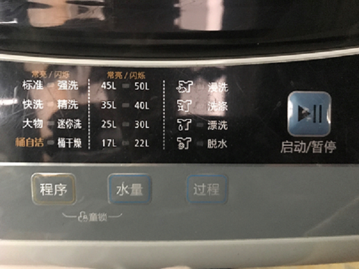

# 自顶向下，逐步求精 & 洗衣机算法设计
# 思想概述
## 自顶向下
> 自顶向下，Top-Down，指的是对大问题的分解，即将我们遇到的复杂的，所谓“大”的问题，分解为小问题，从而方便我们找出问题的关键、重点、突破口所在，进而用更加清晰的、定性定量的方法去描述、解决问题。
## 逐步求精
> 逐步求精指的是我们对问题的一种映射与转化，即将现实世界中的问题具体化地抽象转化为对应领域、世界的问题；将复杂问题经过抽象化处理，精简、分解为相对简单的小问题，从而实现将整个大问题细化精确到某些简单小问题的解决中。
# 洗衣机算法设计

上图为一洗衣机的操作界面，由图可知。洗衣程序分为浸洗——洗涤——漂洗——脱水这几个步骤。

伪代码如下：

1.READ 用户选择模式

2.REPEAT 

注水

3.UNTILL 水位 = 注水要求

4.REPEAT 

浸泡

5.UNTILL 时间 = 时间要求

6.WHILE(电机启动时间 > 0)

7.REPEAT 

电机左转3次

电机右转3次

时间-1单位

8.ENDWHILE

9.WHILE(水位 ！= 0)

排水

10.ENDWHILE

11.FOR（脱水时间 > 0） 

电机转动

12.ENDFOR

关闭电源

以上便是洗衣机工作中某环节程序的伪代码大致示例，将其转化为机器认识的指令并有序执行，我们就可以一步步控制洗衣机完成工作。