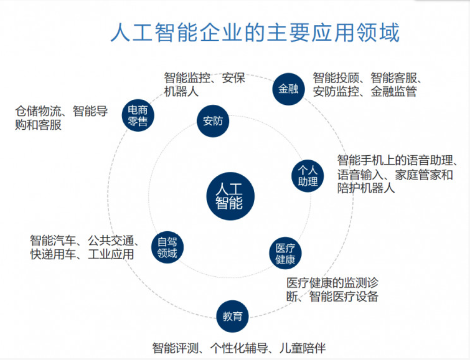
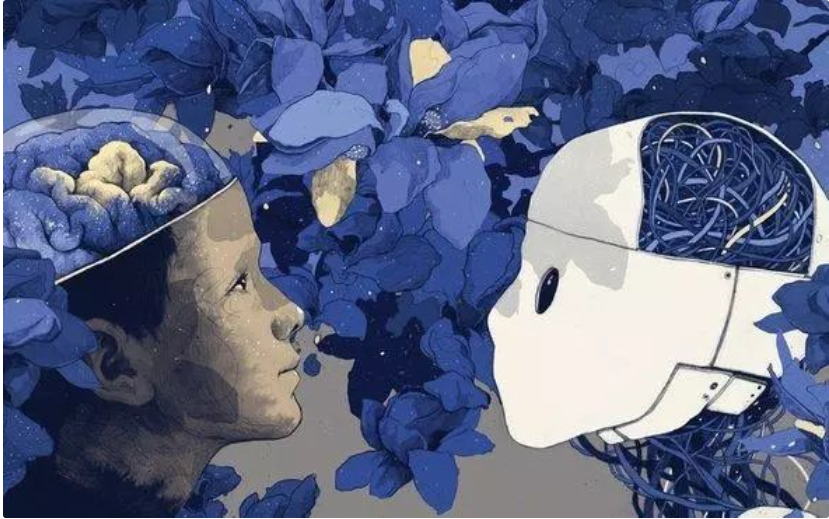
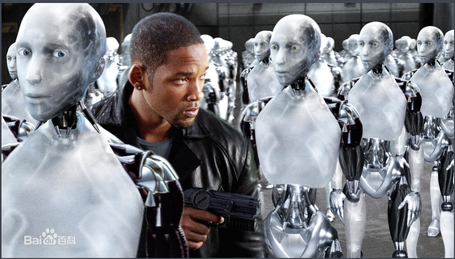

# IT 伦理与道德——人工智能技术与伦理

（以上底特律：变人游戏介绍视频）

## 什么是人工智能？
> 人工智慧（英語：artificial intelligence，縮寫為 AI）亦稱機器智慧，指由人製造出來的機器所表現出來的智慧。通常人工智慧是指通過普通電腦程式的手段實現的人類智慧技術。通常人工智慧是指通過普通電腦程式的手段實現的人類智慧技術。該詞也指出研究這樣的智慧系統是否能夠實現，以及如何實現。同時，人類的無數職業也逐漸被其取代。(维基百科)

## 人工智能的出现意味着什么？
> 阿尔法围棋（AlphaGo）是第一个击败人类职业围棋选手、第一个战胜围棋世界冠军的人工智能机器人，由谷歌（Google）旗下DeepMind公司戴密斯·哈萨比斯领衔的团队开发。其主要工作原理是“深度学习”。2016年3月，阿尔法围棋与围棋世界冠军、职业九段棋手李世石进行围棋人机大战，以4比1的总比分获胜；2016年末2017年初，该程序在中国棋类网站上以“大师”（Master）为注册帐号与中日韩数十位围棋高手进行快棋对决，连续60局无一败绩；2017年5月，在中国乌镇围棋峰会上，它与排名世界第一的世界围棋冠军柯洁对战，以3比0的总比分获胜。围棋界公认阿尔法围棋的棋力已经超过人类职业围棋顶尖水平，在GoRatings网站公布的世界职业围棋排名中，其等级分曾超过排名人类第一的棋手柯洁。

> 自动驾驶汽车（Autonomous vehicles；Self-piloting automobile ）又称无人驾驶汽车、电脑驾驶汽车、或轮式移动机器人，是一种通过电脑系统实现无人驾驶的智能汽车。在20世纪已有数十年的历史，21世纪初呈现出接近实用化的趋势。谷歌自动驾驶汽车于2012年5月获得了美国首个自动驾驶车辆许可证，预计于2015年至2017年进入市场销售。自动驾驶汽车依靠人工智能、视觉计算、雷达、监控装置和全球定位系统协同合作，让电脑可以在没有任何人类主动的操作下，自动安全地操作机动车辆。

## 人与人工智能，该何去何从？

### 关于人与人工智能的作品 

底特律：变人

机器人安德鲁

我，机器人

### 人工智能应该被赋予人权吗？

1. 科幻小说家阿西莫夫曾提出三大法则：
* 第一法则：机器人不得伤害人类个体，或者目睹人类个体将遭受危险而袖手不管；
* 第二法则：机器人必须服从人给予它的命令，当该命令与第一定律冲突时例外；
* 第三定律：机器人在不违反第一、第二定律的情况下要尽可能保护自己的生存。

2. 有些人持正面的态度

> 或许就定义而看，人权适用的范围仅限于人这一物种，不包括人工智能。然而，如果不纠结于字眼，将人权视为生存权，自由权，追求幸福的权利等一些自然权利的集合，讨论这个问题仍是有意义的。与仅仅具备工具属性的弱人工智能相比，强人工智能和人类在高级智能层面相差无几甚至可能有所超出，那是否可以认为其是一个全新的物种？而这一物种和人类的差异无非是生命表现形式的差别，人类是碳基生命而人工智能是钢铁生命。一样高贵的智慧灵魂，难道仅仅因为载体不同便不能平等地享有权利了吗?倘若仅仅利用人工智能的价值而不赋予其相应的权利，那么对人工智能的使用就无异于对奴隶的压迫。而纵观人类历史，对下层的过度压迫势必会导致阶级的对立，而随着矛盾的激化，推翻上层阶级的革命终将来临，直到新的维持阶级统治的工具的诞生。倘若这一规律在人工智能与人类的关系中同样适用，那么科幻片中所幻想的人机之战或许真的无法避免。

 
 片段源自 http://xphi.xmu.edu.cn/archives/2384

 2. 有些人持反面的态度

* 歐盟考慮為機械人賦予「人權」逾百 AI人工智能專家撰公開信反對
https://ezone.ulifestyle.com.hk/article/2050366/%E6%AD%90%E7%9B%9F%E8%80%83%E6%85%AE%E7%82%BA+AI+%E6%A9%9F%E6%A2%B0%E4%BA%BA%E8%B3%A6%E4%BA%88%E3%80%8C%E4%BA%BA%E6%AC%8A%E3%80%8D%E9%80%BE%E7%99%BE%E4%BA%BA%E5%B7%A5%E6%99%BA%E8%83%BD%E5%B0%88%E5%AE%B6%E6%92%B0%E5%AF%AB%E5%85%AC%E9%96%8B%E4%BF%A1%E5%8F%8D%E5%B0%8D

### 引用知乎用户summer clover的一句话作为结尾：当他们自己开始抗争的时候，自然就能争取到“人权”了。无论我们愿不愿意给，我们都不得不让步。
