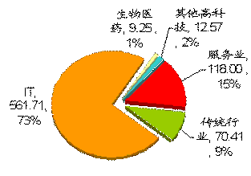
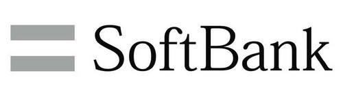

# 风投与中国
## 什么是风投？
> 风险投资（英语：Venture Capital，缩写为VC）简称风投，又译称为创业投资，主要是指向初创企业提供资金支持并取得该公司股份的一种融资方式。风险投资是私人股权投资的一种形式。风险投资公司为一专业的投资公司，由一群具有科技及财务相关知识与经验的人所组合而成的，经由直接投资被投资公司股权的方式，提供资金给需要资金者（被投资公司）。风投公司的资金大多用于投资新创事业或是未上市柜企业（虽然现今法规上已大幅放宽资金用途），并不以经营被投资公司为目的，仅是提供资金及专业上的知识与经验，以协助被投资公司获取更大的利润为目的，所以是一追求长期利润的高风险高报酬事业。

## 软银————IT风投的胜利者
> 软银集团在1981年由孙正义在日本创立并于1994年在日本上市，是一家综合性的风险投资公司，主要致力IT产业的投资，包括网络和电信。软银在全球投资过的公司已超过600家，在全球主要的300多家 IT公司拥有多数股份。

## 中国IT风投——阿里巴巴的成功
#### 据 IT 桔子历史数据统计，目前共收录中国人工智能企业 467 家，共发生 636 起投资事件，投资总额高达 574 亿人民币。

#### 其中，2015 年人工智能创业热度最高，当年人工智能创业公司数量达到 130 家。计算机视觉成为人工智能创业最火热的子领域，该子领域创业公司数量将近 90 家，自然语言处理紧随其后位列第二。
#### 而在1999～2008年的10年期间，广义IT行业平均以53％的比例占据了国内风投市场的大半壁江山。风投为自己带来巨额回报的同时，也成就了一家家神话般的科技公司。
#### 如著名的阿里巴巴，就是在孙正义投资2000万美元后，才保证了阿里有足够的资金开展业务，不被卖掉。阿里巴巴先后在香港联交、纽约证券交易所上市，市值从香港联交所200亿美元到纽交所的1748.28亿美元，成为市值仅次于苹果、谷歌和微软的大型互联网公司。马云和他的创业团队，由此缔造了中国互联网史上最大的奇迹。