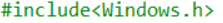
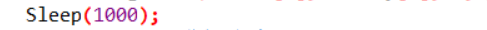
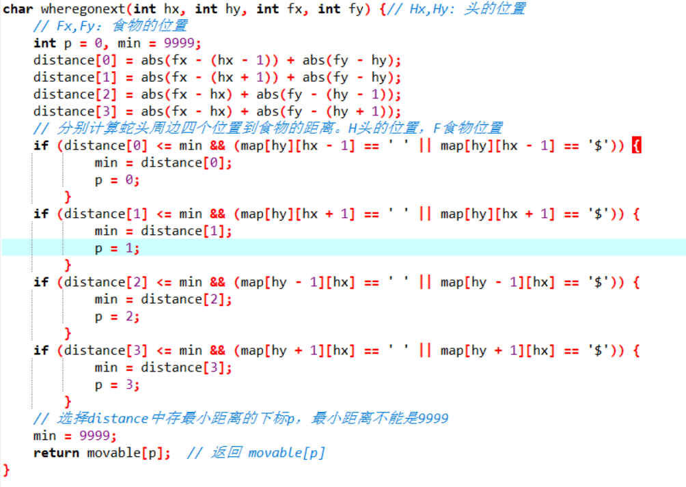
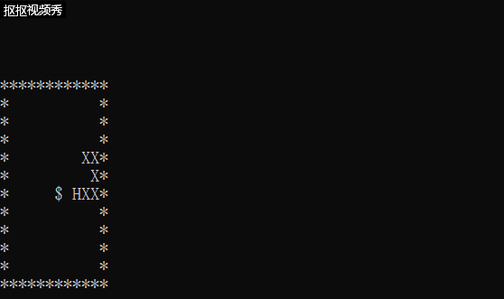

# 字符游戏-智能蛇
## 实现智能蛇每秒走一步
加载windows库





Sleep(1000);(单位为毫秒)



## 实现智能蛇自动行走


## Linux下的指令运用
打开终端：在Linux下, Ctrl + alt + t 可以打开Terminal （终端）。 


进入文档编辑代码：
在终端里输入vim snake.c，回车即可使用vim编辑代码； 按下“i”，进入编辑模式；编辑完成后，按”ESC”键，回到命令模式，然后按下”:wq”，即可保存并退出。 

编译文件：输入:gcc snake.c –o snake.out，即可将snake.c文件编译成snake.out文件。编译成功以后，在终端输入: ./snake回车即可看到运行结果。
## 主程序伪代码
```c
输出字符矩阵
	WHILE not 游戏结束 DO
        wait(time)
		ch＝whereGoNext(Hx,Hy,Fx,Fy)
		CASE ch DO
		‘A’:左前进一步，break 
		‘D’:右前进一步，break    
		‘W’:上前进一步，break    
		‘S’:下前进一步，break    
		END CASE
		输出字符矩阵
	END WHILE
	输出 Game Over!!! 
```

## 代码实现动画


## 最后附上网上大神的代码实现


