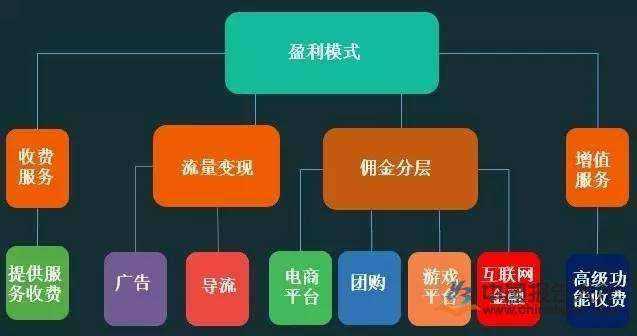
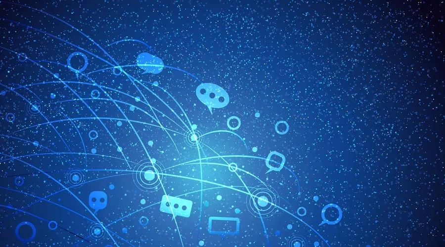
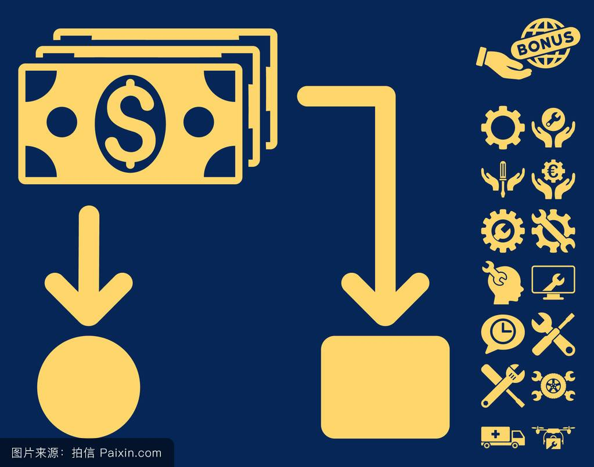

# 互联网时代的盈利模式
# 互联网时代下十大商业模式

1. 传统门户：典型的企业如：新浪、网易、搜狐等。 
2. 垂直门户​：例如：搜房网、携程网等专业网站。 
3. ​电子商务：例如：亚马逊、阿里巴巴、 京东、苏宁等。 
4. 网络通讯：例如我们日常生活中最熟悉的QQ、MSN等。 
5. 搜索引擎：例如百度、谷歌等。 
6. 休闲娱乐：例如爱奇艺、搜狐视频等。 
7. 生活服务：例如嘀嘀打车、美团外卖等。 
8. 无线增值：例如借贷宝、同花顺等（从来没有用过，并不是很熟悉）。 
9. 社区交友：例如人人网、陌陌等。 
10. 导航/资讯：例如QQ网址导航、凤凰资讯网等。

# Q：联网行业的盈利方式是什么？A：分别为：广告盈利、销售盈利、渠道盈利。

### 广告盈利的网络公司相当于传统的广告公司和媒体，它们帮助广告主制作或者发布广告来获得收入。新浪网就是典型的广告盈利。 
### 销售盈利的网络公司相当于传统的店铺或集市，它们自己销售产品或者帮助生产商销售产品，通过差价或者租金来获得收入。阿里巴巴、淘宝网、慧聪网就是典型的销售盈利。 
### 渠道盈利的网络公司搭建通往用户的渠道，只要所搭建的渠道是畅通的，有效的，就可以在这个渠道中销售相应的产品来获得收入。现在流行的SNS社区都是渠道盈利模式（它们现在盈利还是将来盈利，那是另一个话题）其中最值得一提的是腾讯公司，它依靠QQ这个沟通工具，搭建了与用户之间的强大通道，这个通道的唯一性和排他性将用户牢牢捆起来，无法脱离。这个时候，腾讯想卖什么就卖什么：广告（腾讯网）、产品（拍拍网）、道具、虚拟币、游戏……这就是典型的渠道盈利模式。

## 流量的本质是用户关注度
### 当你源源不断的受到关注时，您便成为一个“窗口”，金钱自会随之而来，流量自会转为商业价值。
## 流量意味着体量，体量意味着分量
### 传统零售行业的选址，核心指标就是：“流量”、“流量”、“流量”其本质是抢占人流量的入口。互联网经济一样，也是一门流量生意。
## 流量是所有商业模式得以改进的基础，缺乏流量基础则一切无从谈起！
### 例如京东、1号店、一样做了好多年电商都不是很赚钱，都是在花钱咋流量。

## 总结：流量思维要求我们能够意识到流量的重要性，并且知道如何获取流量、让流量产生价值。运用流量所产生的经济效益来加大自身的竞争力，打造更好未来。