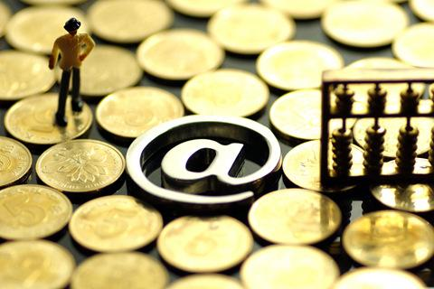
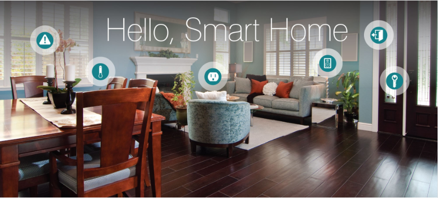
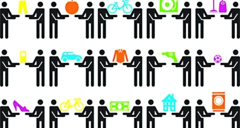
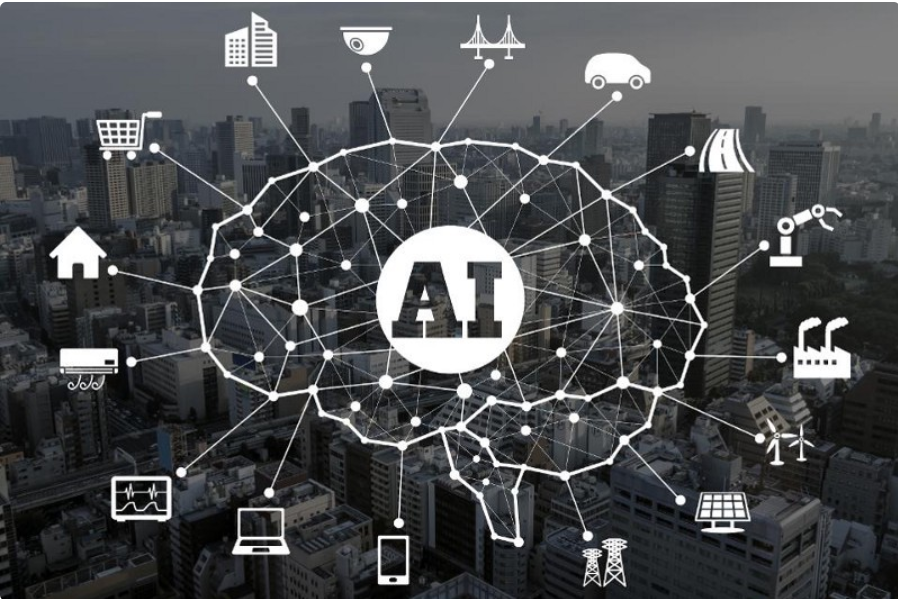

# 互联网时代的热点领域选择
## 互联网金融

> 互联网金融（ITFIN）是指传统金融机构与互联网企业利用互联网技术和信息通信技术实现资金融通、支付、投资和信息中介服务的新型金融业务模式。

* 互联网金融在实现安全、移动等网络技术水平上，被用户熟悉接受后（尤其是对电子商务的接受），自然而然为适应新的需求而产生的新模式及新业务。
## 智能家居

> 智能家居（smart home, home automation）是以住宅为平台，利用综合布线技术、网络通信技术、 安全防范技术、自动控制技术、音视频技术将家居生活有关的设施集成，构建高效的住宅设施与家庭日程事务的管理系统，提升家居安全性、便利性、舒适性、艺术性，并实现环保节能的居住环境。

* 科技给生活带来了便利，让人们回家有更多的时间享受生活，当然，这也是智能家居的初衷，解放生产力。未来智能家居必将更多成为人们的选择。
## 共享经济

> 共享经济，一般是指以获得一定报酬为主要目的，基于陌生人且存在物品使用权暂时转移的一种新的经济模式。此种共享更多的是通过互联网作为媒介来实现的。

* 共享单车，滴滴打车，共享汽车……越来越多的共享经济出现为社会带来了无穷的商机与风险。
## 人工智能

> 人工智能（Artificial Intelligence），英文缩写为AI。它是研究、开发用于模拟、延伸和扩展人的智能的理论、方法、技术及应用系统的一门新的技术科学。

* 人工智能在大数据时代下，丰富的数据，加上利用大规模负责数据集的能力不断增强，正在给健康、生活方式、交通、教育以及几乎所有的人类活动的改善带来空前的机会。

### 总结：未来互联网产业的发展空间是巨大的，会给我们的生活带来翻天覆地的变化。对待上述热点都必须冷静、理智，不能盲目乐观的投入。而基于对当下时代的把握和对未来发展的思考，硕利科技早已制定好了精准的大数据控方案，通过科学的项目运营，力将风险降到最低，为所有参与者都带来可观收益。
# 互联网时代的营销方法
> 互联网营销也称为网络营销，就是以国际互联网络为基础，利用数字化的信息和网络媒体的交互性来实现营销目标的一种新型的市场营销方式。

如何定义网络营销其实并不是最重要的，关键是要理解网络营销的真正意义和目的，也就是充分认识互联网这种新的营销环境，利用各种互联网工具为企业营销活动提供有效的支持。

这段话里面的关键是“充分认识互联网这种新的营销环境”，很多互联网营销看到的都是“工具”，而没有看到环境，没有看到互联网的本质。和当年洋务运动失败的原因一样样的。只改变了工具，而没有随着外部环境的变换而去改变自己的内核。

那么”互联网的新营销环境“是什么呢？互联网的本质是什么？

马化腾很早就告诉我们了，互联网的本质就是“连接”。互联网、移动互联网、物联网在做的都是使得我们的连接效率不断提升。那么互联网连接的是什么？就是人呀！

而产品只是我们和用户之间的连接载体。营销是为了建立人和用户之间的连接。